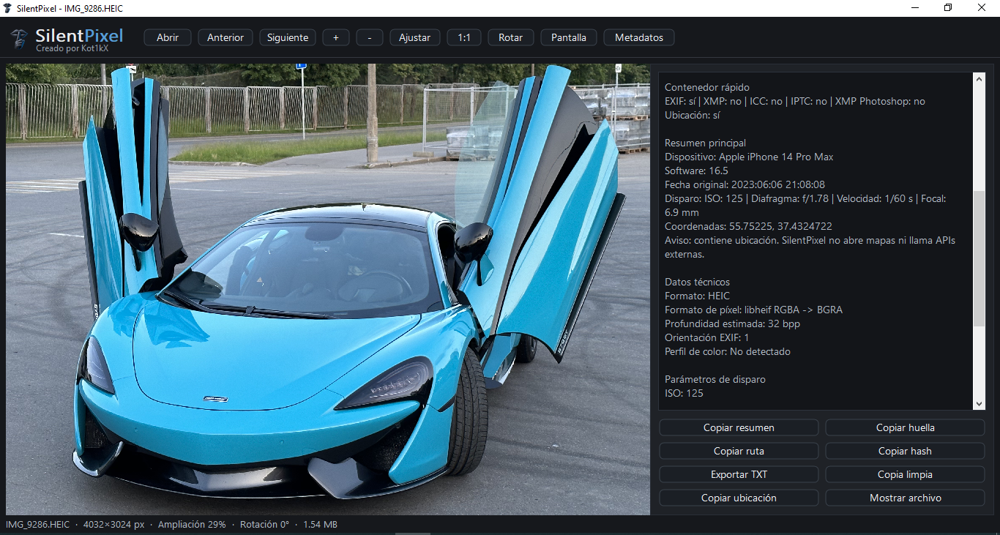

# SilentPixel

SilentPixel es un visor local de imágenes para Windows con inspección técnica de metadatos.

Está diseñado para abrir imágenes desde el propio equipo, mostrar información útil del archivo y evitar dependencias innecesarias de servicios externos.

## Requisitos

- Windows 10 / Windows 11.
- Sistema de 64 bits recomendado.
- Extrae la carpeta portable completa antes de ejecutar `SilentPixel.exe`.

## Objetivo

SilentPixel nace como una alternativa ligera, portable y privada a los visores de imágenes modernos que dependen de cuentas, servicios en segundo plano, sincronización, nube o telemetría.

La idea es sencilla:

- abrir imágenes locales;
- mostrar los metadatos que el archivo ya contiene;
- no llamar a internet;
- no abrir mapas;
- no crear historial de archivos recientes;
- no depender de servicios externos.

## Funciones principales

- Apertura de imágenes JPG, JPEG, PNG, BMP, HEIC y HEIF.
- Navegación entre imágenes de una carpeta.
- Zoom, ajuste a ventana, tamaño real y pantalla completa.
- Rotación visual.
- Panel de metadatos técnico.
- Exportación de informe TXT.
- Copia de resumen, hash, huella visual y coordenadas.
- Hashes SHA-256, SHA-1 y MD5.
- Huellas visuales aHash/dHash para comparación aproximada.
- Lectura de EXIF, XMP, GPS, ICC/IPTC detectado y metadatos WIC cuando están disponibles.

## Privacidad

SilentPixel está pensado para funcionar de forma local.

- No usa nube.
- No usa cuentas.
- No incluye telemetría propia.
- No abre mapas.
- No llama a APIs externas.
- No guarda historial/MRU.
- No instala servicios en segundo plano.
- No usa Electron ni WebView.
- No abre enlaces encontrados dentro de metadatos.

Si una imagen contiene coordenadas GPS, SilentPixel las muestra como texto y permite copiarlas. La aplicación no abre Google Maps, no consulta servicios de mapas y no envía esas coordenadas a terceros.

## Metadatos

SilentPixel muestra información que ya está dentro del archivo, cuando existe:

- cámara o dispositivo;
- modelo;
- software;
- fecha original;
- ISO;
- apertura;
- velocidad de obturación;
- distancia focal;
- lente;
- orientación EXIF;
- coordenadas GPS;
- bloques EXIF/XMP/ICC/IPTC;
- identificadores XMP;
- software de edición;
- sistema o plataforma indicada por el propio archivo.

SilentPixel no inventa metadatos ni intenta deducir información que el archivo no expone.

> "La foto ya venía hablando." SilentPixel solo le pone subtítulos.

## Contenedor técnico

El apartado de contenedor funciona como inventario técnico del JPEG/HEIC:

- EXIF detectado;
- XMP detectado;
- ICC detectado;
- IPTC detectado;
- tamaño de bloques;
- vista previa de XMP cuando es texto útil.

ICC e IPTC se muestran como bloques detectados, sin intentar convertir el informe en una salida completa de ExifTool.

## Formatos soportados

SilentPixel abre:

- JPG / JPEG
- PNG
- BMP
- HEIC / HEIF

El paquete portable de Windows incluye las librerías necesarias para abrir HEIC/HEIF. No hace falta instalar extensiones de Microsoft Store ni añadir componentes externos para usar HEIC desde la versión portable.

Para HEIC/HEIF, conserva todos los archivos incluidos en la carpeta portable. No ejecutes `SilentPixel.exe` separado de sus DLL.

## RAW

SilentPixel no abre RAW en esta versión.

Formatos como NEF, CR2, CR3, ARW, RAF, ORF, RW2, DNG, PEF o SRW son archivos de trabajo/revelado, no formatos finales de visualización general.

## Dispositivos probados

SilentPixel se ha probado con archivos reales de distintas cámaras y dispositivos, incluyendo:

### Apple

- iPhone 11
- iPhone 12 Pro Max
- iPhone 14 Pro Max
- iPhone 16 Pro Max
- iPhone 17 Pro Max
- iPhone XS Max

### Android

- Xiaomi REDMI Note 15
- Xiaomi Redmi Note 9 Pro
- Xiaomi Redmi 4A
- Samsung Galaxy S23 Ultra
- Google Pixel 7 Pro
- Motorola moto g85 5G

### Canon

- Canon EOS 5D
- Canon EOS R
- Canon EOS R6
- Canon EOS R7

### Nikon

- Nikon D3100
- Nikon D40X
- Nikon COOLPIX S3600
- Nikon Z 6_2
- Nikon Z 7

### Sony

- Sony ILCE-1M2 / A1 II
- Sony ILCE-9M3 / A9 III
- Sony ILCE-7RM5 / A7R V
- Sony ILCE-6700 / A6700
- Sony ILCE-7CM2 / A7C II
- Sony ILCE-7M4 / A7 IV

### Fujifilm

- Fujifilm X-T2

### Panasonic

- Panasonic DMC-TZ7
- Panasonic DMC-FZ30

### OM System / Olympus

- OM Digital Solutions OM-1
- OM Digital Solutions OM-5

### Pentax

- Pentax K-1

### Leica

- Leica Q Typ 116
- Leica Q2

### Ricoh

- Ricoh GR III

### GoPro

- GoPro HERO 7
- GoPro HERO9 Black
- GoPro HERO10 Black
- GoPro Max

### DJI

- DJI FC220

## Instalación

SilentPixel es portable.

1. Descarga el ZIP de la release.
2. Extrae la carpeta completa.
3. Ejecuta `SilentPixel.exe`.

No requiere instalación tradicional.

Para que HEIC/HEIF funcione correctamente, mantén `SilentPixel.exe` junto al resto de archivos incluidos en el paquete portable.

## Uso básico

- Abrir: selecciona una imagen.
- Anterior / Siguiente: navega por la carpeta actual.
- Ajustar: ajusta la imagen a la ventana.
- 1:1: muestra tamaño real.
- Rotar: rota visualmente la imagen.
- Pantalla: alterna pantalla completa.
- Metadatos: muestra u oculta el panel técnico.
- Exportar TXT: genera un informe técnico del archivo actual.

## Licencia

MIT License.

Consulta el archivo `LICENSE`.

## Estado

Versión inicial pública: `v0.1.0`.

SilentPixel está en fase inicial, pero ya es funcional como visor local/offline e inspector técnico de metadatos para imágenes comunes.

